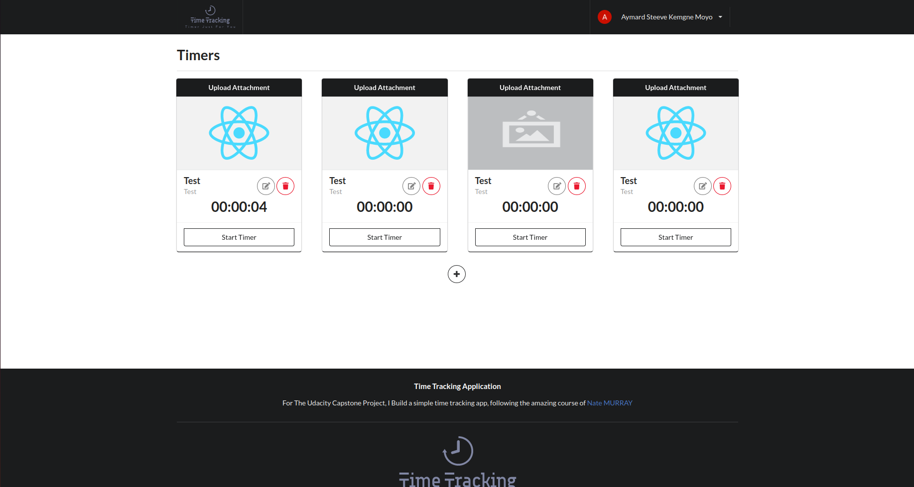
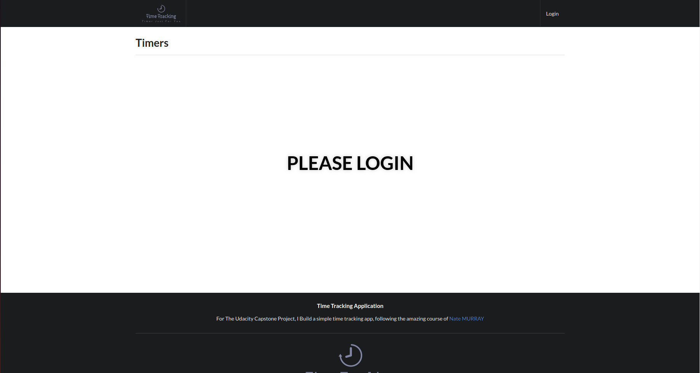
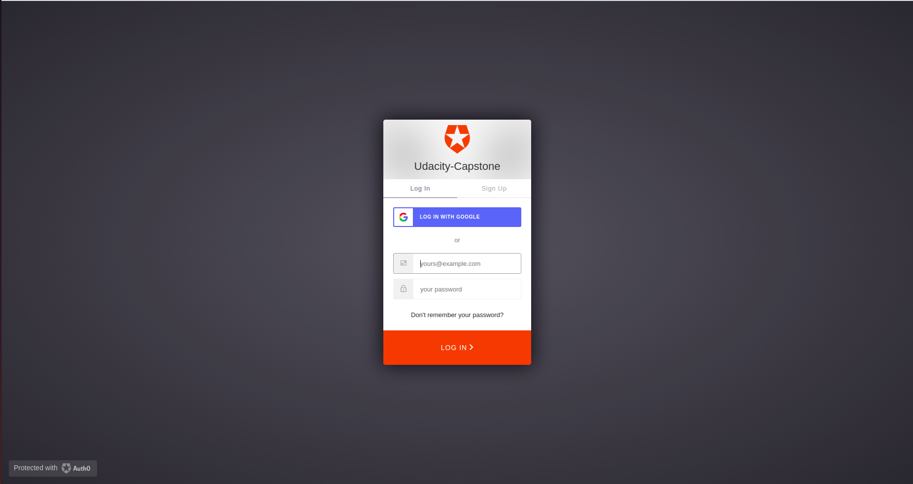
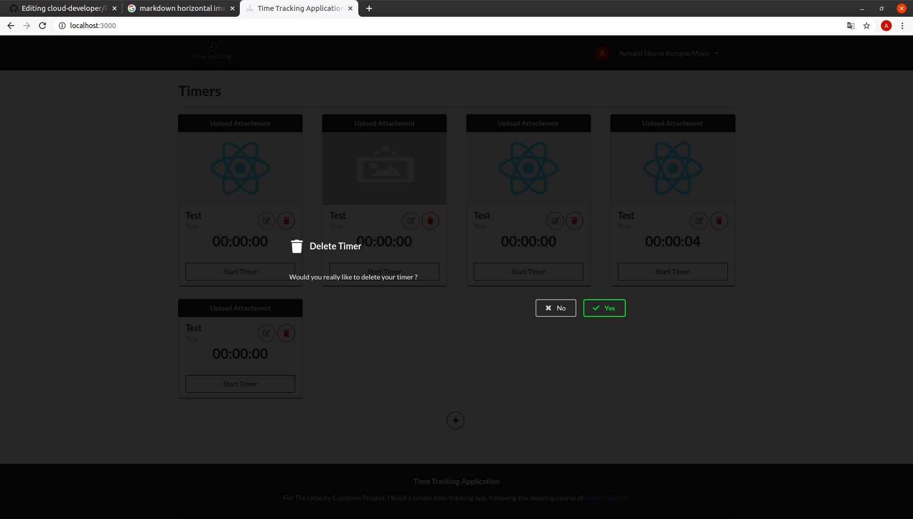
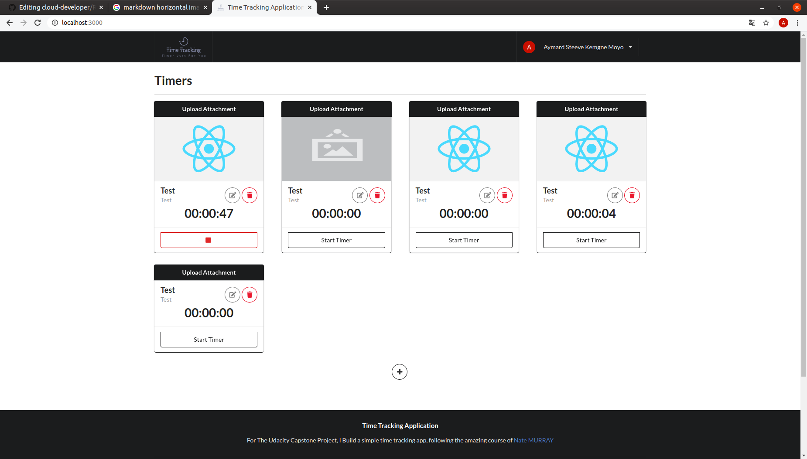
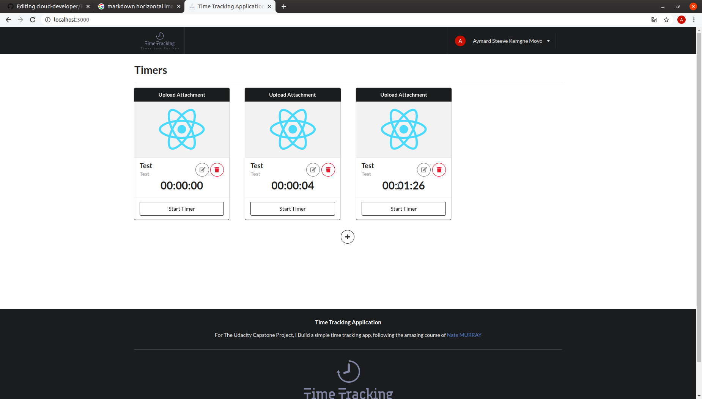
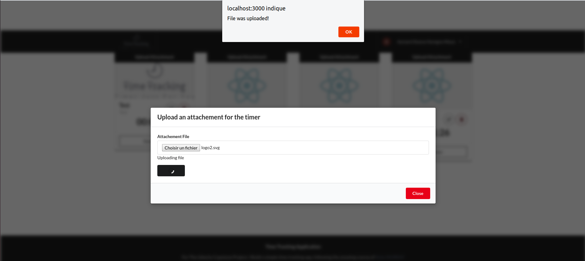

<p align="center"></p>

<p align="center">
<a href="https://travis-ci.org/mckenziearts/shopper"></a>
</p>

## Introduction

Time Tracking Application is the project i realized for passing Capstone Nanodegree Cloud Developer Project. This project is inspired by [Nate Murray](https://twitter.com/eigenjoy) for realizing the client application.
Please note that this package is still under active MIT License.



# Table of Contents

- [Table of Contents](#table-of-contents)
  - [Requirements](#requirements)
  - [Features](#features)
  - [Installation](#installation)
  - [Usage](#usage)
  - [Documentation](#documentation)
    - [Timer Item](#timer-item)
    - [LogIn into the application](#login-into-the-application)
    - [Create a new Timer](#create-a-new-timer)
    - [Update a Timer](#update-a-timer)
    - [Delete a Timer](#delete-a-timer)
    - [Start a Timer](#start-a-timer)
    - [Stop a Timer](#stop-a-timer)
    - [Upload an attachment to a Timer](#upload-an-attachment-to-a-timer)
  - [Credits](#credits)
  - [License](#license)

## Requirements
Make sure your server meets the following requirements.

-   Node > 10.x
-   Yarn > 1.21.x
-   Firefox or Google Chrome Navigator
-   Aws cli v1 
-   Aws account

## Features
We have few features : 

- [x] Create a timer
- [x] Update a timer
- [x] Start a timer
- [x] Stop a timer
- [x] Delete a timer
- [x] Upload an image for a timer
- [x] login on the application
- [x] logoout from the application
- [ ] Reset a timer

## Installation

Firstly, download the project using : 
``` bash  
$ git clone https://github.com/kemsty2/udacity-capstone
```
Install all the dependecies of the client app : 
```bash
$ cd Frontend
$ yarn install
```

This command will install all the required dependecies to run the react client application. 

## Usage

Run webpack live server
```bash
$ yarn start
```

To view the application, go to:
```php
http://localhost:3000/
```

## Documentation

### Timer Item
The application is able to manage timer. A timer item contains the following field : 
* `timerId` (string) - a unique id for a timer
* `userId` (string) - a id which represent the timer owner
* `title` (string) - title of a Timer item (e.g. "Change a light bulb")
* `project` (string) - project name of a Timer item (e.g. "Change a light bulb")
* `elapsed` (number) - amount of time in millisecond the timer have been start an stop
* `runningSince` (number) - amount of time the timer are running. This value is reset to 0 when the timer is stopped. 
* `attachment` (string) (optional) - a URL pointing to an image attached to a Timer item


### LogIn into the application
First, before manage timer, the user should login to the platform. To log into the platform, click on `Login Button`, [Auth0](https://auth0.com) is using as Authentication and Authorization service. 


Click on `Log In with Google`


The only available option for login is : 
- Log in with Google Account

### Create a new Timer
To create a new Timer, Click on `+` Button. 
1. Enter the title and project name of the timer 
2. Click on Create


### Update a Timer
To update a Timer, Click on `Pencil` Button. 
1. Edit the title or the project name of the timer 
2. Click on Update


### Delete a Timer
To delete a Timer, Click on `Trash` Button. 
1. A confirmation modal is open, confirm by clicking on `Yes`



### Start a Timer
To start a Timer, Click on `Start` Button. 
1. The `Start` button switch to become `Stop` Button
2. The counter begin



### Stop a Timer
To stop a running Timer, Click on `Stop` Button. 
1. The `Stop` button switch to become `Start` Button
2. The counter stop



### Upload an attachment to a Timer
To upload an attachment to a timer, click on the `Upload Attachment` Button. 

1. A modal is open, to choose the file you want to upload. 
2. Click on browse, choose your file
3. Click on Upload
4. Click on `Ok` after the alert reveal. 




  
## Credits  
  
- [Kemgne Moyo Steeve Aymard](https://twitter.com/kemsty2)
- [Nate Murray](https://twitter.com/eigenjoy)
  
## License  
  
MIT. Please see the [license file](LICENSE) for more information.    
